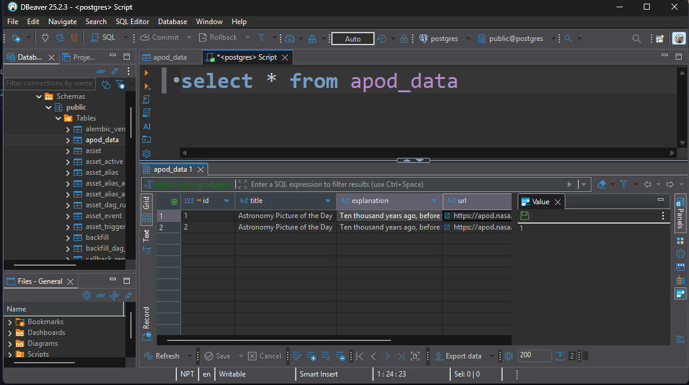

# ETL Pipeline with Apache Airflow & PostgreSQL

<div align="center">


</div>

An automated ETL (Extract, Transform, Load) pipeline built with Apache Airflow that fetches data from NASA's Astronomy Picture of the Day (APOD) API and stores it in a PostgreSQL database.

> [!Note]
> This project was created as a learning exercise to understand ETL pipelines, Apache Airflow orchestration, and containerized database deployments.

## Table of Contents

- [Overview](#overview)
- [Architecture](#architecture)
- [Prerequisites](#prerequisites)
- [Installation & Setup](#installation--setup)
- [Configuration](#configuration)
- [Running the Pipeline](#running-the-pipeline)
- [Database Access](#database-access)
- [Cloud Deployment](#cloud-deployment)
- [Project Structure](#project-structure)

## Overview

This project demonstrates a production-ready ETL pipeline that:
- Extracts daily astronomy data from NASA's APOD API
- Transforms the data to extract relevant fields
- Loads the processed data into a PostgreSQL database
- Runs on a scheduled basis using Apache Airflow

## Architecture

The pipeline consists of the following components:

1. **Apache Airflow**: Orchestrates the ETL workflow
2. **PostgreSQL**: Stores the extracted and transformed data
3. **Docker**: Containerizes the database for easy deployment
4. **NASA APOD API**: Data source for astronomy pictures and information

## Prerequisites

Before you begin, ensure you have the following installed:

- [Docker Desktop](https://www.docker.com/products/docker-desktop)
- [Astro CLI](https://www.astronomer.io/docs/astro/cli/install-cli) - For managing Airflow
- [DBeaver Community Edition](https://dbeaver.io/download/) - For database management (recommended)
- Python 3.8+ (if running Airflow locally)

## Installation & Setup

### 1. Install Astro CLI

Follow the official guide to install Astro CLI for your operating system:
[Astro CLI Installation Guide](https://www.astronomer.io/docs/astro/cli/install-cli)

### 2. Clone the Repository

### 3. Set Up Environment Variables

Create a `.env` file in the root directory with the following variables:

```env
POSTGRES_USER=postgres (could be any)
POSTGRES_PASSWORD=postgres (could be any)
POSTGRES_DB=postgres (could be any)
POSTGRES_PORT=5432
NASA_API_KEY=your_nasa_api_key_here
```

> [!Note] 
> Get your free NASA API key from [NASA API Portal](https://api.nasa.gov/)

### 4. Install Required Packages

Ensure all dependencies listed in `requirements.txt` are installed:

```bash
pip install -r requirements.txt
```

### 5. Start PostgreSQL Database

Launch the PostgreSQL container using Docker Compose:

```bash
docker-compose up -d
```

Verify the container is running:

```bash
docker ps
```

### 6. Start Airflow

Initialize and start Airflow using Astro CLI:

```bash
astro dev start
```

This will start the Airflow webserver, scheduler, and triggerer.

## Configuration

### Configure Airflow Connections

1. Access the Airflow UI at `http://localhost:8080`
2. Navigate to **Admin → Connections**
3. Add the following connections:

#### PostgreSQL Connection
- **Connection Id**: `my_postgres_conn`
- **Connection Type**: `Postgres`
- **Host**: `postgres_db` (container name)
- **Schema**: `postgres`
- **Login**: `postgres`
- **Password**: `postgres`
- **Port**: `5432`

#### NASA API Connection
- **Connection Id**: `nasa_api`
- **Connection Type**: `HTTP`
- **Host**: `https://api.nasa.gov`
- **Extra**: `{"api_key": "your_nasa_api_key_here"}`

> [!Important]
> The PostgreSQL host should be the container name (`postgres_db`) since both Airflow and PostgreSQL run in Docker networks.

## Running the Pipeline

1. Open the Airflow UI at `http://localhost:8080`
2. Find the DAG named `etl_learn_proj`
3. Toggle the DAG to enable it
4. Trigger the DAG manually or wait for the scheduled run (daily)

The pipeline will:
1. Create the `apod_data` table if it doesn't exist
2. Extract data from NASA APOD API
3. Transform and validate the data
4. Load the data into PostgreSQL

## Database Access

### Using DBeaver

1. Open DBeaver and create a new database connection
2. Select **PostgreSQL** as the database type
3. Configure the connection:
   - **Host**: `localhost` (or the Docker container hostname)
   - **Port**: `5432`
   - **Database**: `postgres`
   - **Username**: `postgres`
   - **Password**: `postgres`
4. Test the connection and save

> **Tip:** If connecting from outside Docker, use `localhost`. If connecting from another container, use the container name `postgres_db`.

### Query the Data

```sql
SELECT * FROM apod_data;
```

<div align="center">
    
</div>

## Cloud Deployment

> [!Note] 
> Cloud deployment is currently untouched in this project, but the following steps outline how to deploy to Astronomer Cloud with AWS RDS.

### Deploying to Astronomer Cloud with AWS RDS

#### 1. Login to Astronomer Cloud

```bash
astro login
```

Follow the authentication prompts to log in to your Astronomer Cloud account.

#### 2. Set Up AWS RDS PostgreSQL Database

1. Go to [AWS RDS Console](https://console.aws.amazon.com/rds/)
2. Click **Create database**
3. Select **PostgreSQL** as the engine type
4. Configure your database settings:
   - **DB Instance Identifier**: Choose a name (e.g., `airflow-etl-db`)
   - **Master Username**: Set your username
   - **Master Password**: Set a secure password
   - **DB Instance Class**: Choose based on your needs (e.g., `db.t3.micro` for testing)
   - **Storage**: Configure as needed
   - **VPC & Security**: Ensure proper network access
5. Click **Create database**
6. Once created, note down the **Endpoint (Host ID)** from the database details

#### 3. Update Airflow Connection for Cloud

In your Astronomer Cloud deployment, configure the PostgreSQL connection:

- **Connection Id**: `my_postgres_conn`
- **Connection Type**: `Postgres`
- **Host**: `<your-rds-endpoint>.rds.amazonaws.com` (from AWS RDS)
- **Schema**: `postgres`
- **Login**: Your RDS master username
- **Password**: Your RDS master password
- **Port**: `5432`

#### 4. Deploy to Astronomer

```bash
astro deploy
```

Select your workspace and deployment when prompted.

> [!Important] 
> Ensure your AWS RDS security group allows inbound connections from Astronomer Cloud IP addresses. Check [Astronomer's documentation](https://www.astronomer.io/docs/) for the list of IP addresses to whitelist.

## Project Structure

```
ETL_Pipeline-Airflow-Postgres/
├── dags/
│   └── etl_pipeline.py          # Main ETL DAG definition
├── include/                      # Additional scripts and utilities
├── plugins/                      # Custom Airflow plugins
├── tests/
│   └── dags/
│       └── test_dag_example.py  # DAG tests
├── .env                         # Environment variables (not in repo)
├── docker-compose.yml           # PostgreSQL container configuration
├── Dockerfile                   # Custom Airflow image
├── requirements.txt             # Python dependencies
├── packages.txt                 # System packages
├── airflow_settings.yaml        # Airflow configuration
└── README.md                    # This file
```

## Troubleshooting

### Port Already in Use
If port 5432 is already in use, modify the `POSTGRES_PORT` in `.env` file:
```env
POSTGRES_PORT=5433
```

### Connection Issues
- Ensure Docker containers are running: `docker ps`
- Check container logs: `docker logs postgres_db`
- Verify network connectivity: `docker network ls`

### Airflow DAG Not Appearing
- Check DAG file syntax: `astro dev parse`
- Review Airflow logs: `astro dev logs`
- Restart Airflow: `astro dev restart`


